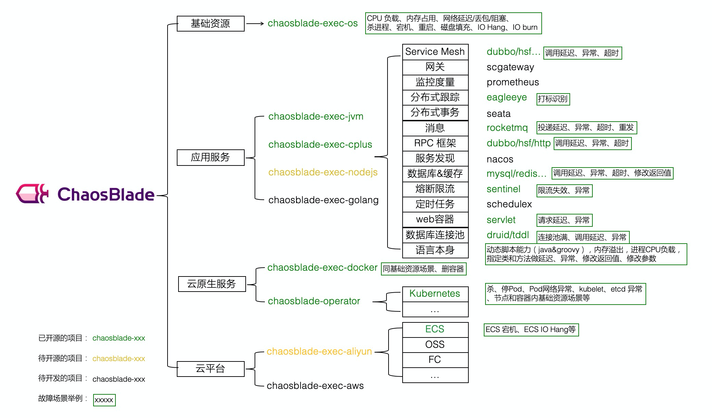

# Chaosblade Operator: 面向云原生的混沌工程执行工具

## 介绍
Chaosblade Operator 是混沌工程实验工具 ChaosBlade 下的一款面向云原生领域的混沌实验注入工具，可单独部署使用。通过定义 Kubernetes CRD 来管理混沌实验，每个实验都有非常明确的执行状态。工具具有部署简单、执行便捷、标准化实现、场景丰富等特点。将 ChaosBlade 混沌实验模型与 Kubernetes CRD 很好的结合在一起，可以实现基础资源、应用服务、容器等场景在 Kubernetes 平台上场景复用，方便了 Kubernetes 下资源场景的扩展，而且可通过 chaosblade cli 统一执行调用。

[ChaosBlade生态图](https://github.com/chaosblade-io/chaosblade)



## 支持的场景
目前实验场景涉及到资源包含 Node、Pod、Container，具体支持的场景如下：

Node：

- CPU: 指定 CPU 使用率
- 网络: 指定网卡、端口、IP 等包延迟、丢包、包阻塞、包重复、包乱序、包损坏等
- 进程：指定进程 Hang、强杀指定进程等
- 磁盘：指定目录磁盘填充、磁盘 IO 读写负载等
- 内存：指定内存使用率

Pod：

- 网络：指定网卡、端口、IP 等包延迟、丢包、包阻塞、包重复、包乱序、包损坏等
- 磁盘：指定目录磁盘填充、磁盘 IO 读写负载等
- 内存：指定内存使用率
- Pod：杀 Pod

Container：

- CPU: 指定 CPU 使用率
- 网络: 指定网卡、端口、IP 等包延迟、丢包、包阻塞、包重复、包乱序、包损坏等
- 进程：指定进程 Hang、强杀指定进程等
- 磁盘：指定目录磁盘填充、磁盘 IO 读写负载等
- 内存：指定内存使用率
- Container: 杀 Container

## 安装
在 [Release](https://github.com/chaosblade-io/chaosblade-operator/releases) 地址下载最新的 `chaosblade-operator-VERSION-v3.tgz` 包

使用 `helm install chaosblade-operator chaosblade-operator-VERSION-v3.tgz --namespace kube-system` 命令安装

使用 `kubectl get pod -l part-of=chaosblade -n kube-system` 查看 Pod 的安装状态，如果都是 running 状态，说明安装成功

使用以下命令卸载，注意执行顺序:
```shell
kubectl delete crd chaosblades.chaosblade.io
helm uninstall chaosblade-operator -n kube-system
```

## Reference
[chaosblade-operato](https://github.com/chaosblade-io/chaosblade-operator)

